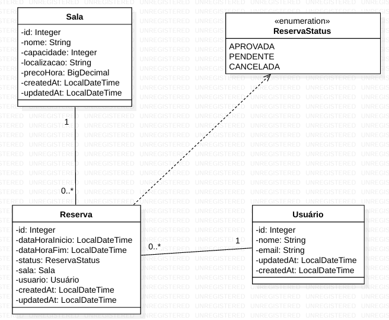
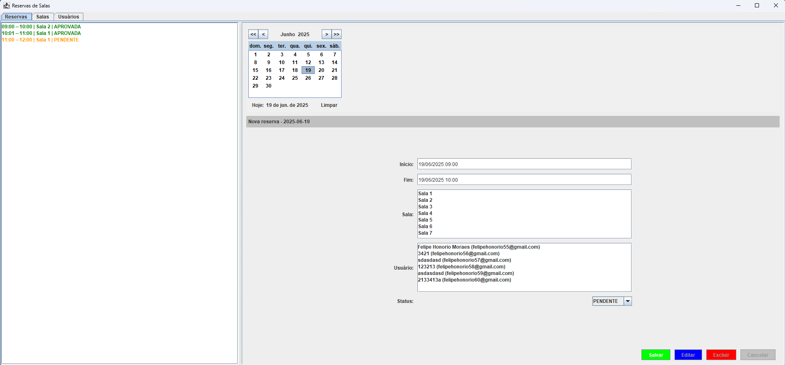
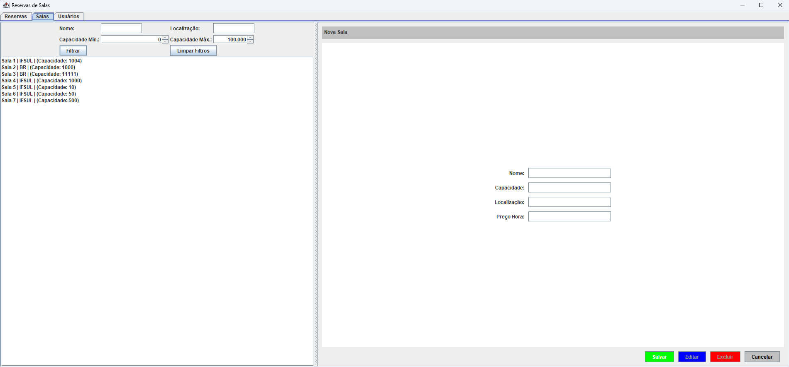

# Trabalho final LPOO

Para executar você pode inicializar o banco de dados com o comando:

```bash
docker compose up
```

# Modelagem



# Descrição

Vou desenvolver uma aplicação que permita reservar salas de reunião, laboratórios ou auditórios. Nele será possível cadastrar salas (com nome, capacidade e localização, preço) e usuários (nome, e-mail), além de criar reservas indicando data e hora de início e fim. Sempre que alguém tentar marcar um horário, o sistema verifica automaticamente se já existe outra reserva sobrepondo aquele intervalo na mesma sala e, caso haja conflito, bloqueia a operação com uma mensagem clara ao usuário.
A tela principal oferecerá menus para cadastros de salas, usuários e reservas, todos com operações de criar, listar, atualizar e excluir. As reservas nascem com status “Pendente” e podem ser aprovadas ou canceladas posteriormente.
Também será possível filtrar as reservas por sala, por usuário ou por período.
Entidades: Sala, Usuário e Reserva

# Telas

Reserva de salas


Cadastro de salas


Cadastro de usuários


# Gerar artefato

```bash
    mvn clean package
```

# Uso

| Etapa                        | Ação                                                                                                                                                                                                                                         |
| ---------------------------- |----------------------------------------------------------------------------------------------------------------------------------------------------------------------------------------------------------------------------------------------|
| **1 – Cadastrar salas**      | **Salas ➜ Novo**<br>Preencha **nome**, **capacidade**, **localização** e **preço/hora**, clique em salvar ✓                                                                                                                                  |
| **2 – Cadastrar usuários**   | **Usuários ➜ Novo**<br>Informe **nome** e **e-mail**, clique em salvar ✓                                                                                                                                                                     |
| **3 – Criar reserva**        | 1. Abra **Reservas**<br>2. **Escolha a data** no calendário à esquerda<br>3. Defina **início** e **fim** (formato `dd/MM/yyyy HH:mm`)<br>4. Selecione **sala** e **usuário** nas listas<br>5. Clique **Salvar** → status inicial **Pendente** |
| **4 – Conflitos de horário** | Se houver sobreposição de horário na mesma sala, um aviso em **vermelho** aparece logo abaixo do formulário.                                                                                                                                 |
| **5 – Aprovar ou cancelar**  | Selecione a reserva → **Editar** → altere **Status** → **Salvar**                                                                                                                                          |

