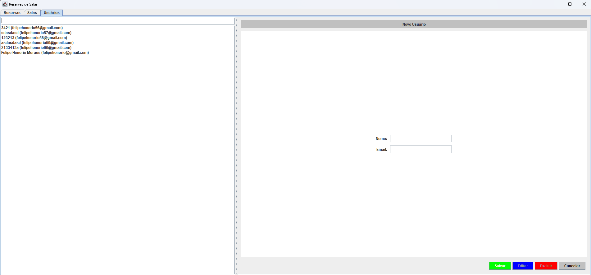

# Trabalho final LPOO

Para executar você pode inicializar o banco de dados com o comando:

```bash
docker compose up
```

# Modelagem


# Descrição

Vou desenvolver uma aplicação que permita reservar salas de reunião, laboratórios ou auditórios. Nele será possível cadastrar salas (com nome, capacidade e localização, preço) e usuários (nome, e-mail), além de criar reservas indicando data e hora de início e fim. Sempre que alguém tentar marcar um horário, o sistema verifica automaticamente se já existe outra reserva sobrepondo aquele intervalo na mesma sala e, caso haja conflito, bloqueia a operação com uma mensagem clara ao usuário.
A tela principal oferecerá menus para cadastros de salas, usuários e reservas, todos com operações de criar, listar, atualizar e excluir. As reservas nascem com status “Pendente” e podem ser aprovadas ou canceladas posteriormente.
Também será possível filtrar as reservas por sala, por usuário ou por período.
Entidades: Sala, Usuário e Reserva

# Telas

Reserva de salas


Cadastro de salas


Cadastro de usuários


# Gerar artefato

```bash
    mvn clean package
```